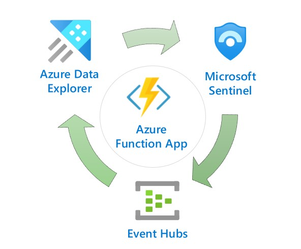
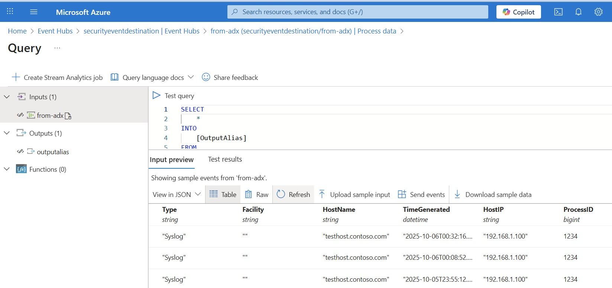

# ADX to Sentinel - Continuous Data Pipeline

  

An Enterprise Grade Data Pipeline solution for enabling continuous, KQL filtered data forwarding from Azure Data Explorer (ADX) to Microsoft Sentinel via Data Collection Rules (DCR).  

This project demonstrates the usability of an Azure Function App for reliable, continuous scanning for near real-time promotion of data using KQL queries to Log Analytics / Sentinel.  Alternately, the solution may be used for KQL forwarding of events to nominated Event Hubs.

This project focusses on selective data promotion from large scale ADX data collection to Microsoft Sentinel, the concept can be used for almost endless monitoring scenarios.

- Slash Microsoft Sentinel cost by pre-filtering noisy logs

- Enable near real-time Microsoft Sentinel alerting on all events including performance metrics

- True, universal Data Lake centralisation of Enterprise data on Kusto with dedicated Log Analytics workspaces for different teams.  There is no reason why you couldn't repurpose Sentinel workspaces as case management systems for Technology support or Network teams!

- Use KQL for forwarding events to Event Hubs for triggering SOAR and automation activities

From a Security perspective, real-time alerting against Petabyte data sets is a critical business requirement. This example project shows how this is achieved.

## Why This Solution

Combining Function Apps with Azure Data Explorer (ADX) provides an extremely flexible and cost-effective method for achieving almost any business goal with Business Data.  

KQL as a modern query language is well suited for any form of data pipeline and can be easily integrated with Function Apps.  Real-time scanning of incoming data allows for enormous capability with orchestration from data events.

This Function App uses a YAML configuration file to forward data that matches queries of a specific type to a targetted table in Log Analytics / Sentinel.  This allows for any large-volume logging to be receive real-time security alerting with Sentinel's Analytics Logs using the same KQL queries Security Operations are familiar with.

#### Optional Alternate Data Destination (Event Hub)

As an alternate destination, for data queried from Azure Data Explorer, positively matched records may be sent to a dedicated Event Hub.  This alternate data pipeline mechanism allows for:

* Developing solutions with Event Hub Triggered Response Automation using Event Hubs

* Broader integration with Microsoft Fabric past the Workspace Shortcut method for data access.  

## Enterprise Value

**Cost Optimisation**: Forward only specific security-relevant data to Sentinel whilst maintaining comprehensive ADX collection of ALL technology data and signals, including performance counters, log events and network stream data.  For most Enterprise environments, this cost savings will cover the Infrastructure costs of a High Availability Azure Data Explorer solution.

**Query Standardisation**: This continuous pipeline uses familiar KQL queries for forwarding data from ADX to Sentinel rather than needing to incorporate different scripting and query languages.

**Real-Time Detection**: Filter all log streams for Sentinel Analytics forwarding in near real-time whilst preserving complete historical data in ADX.  Large Enterprise needs real-time alerting against all data including the performance metics alerting on systems.  This allows this requirement to be met in a cost effective manner.

**Enterprise Scale**: Queue-managed processing handles unlimited tables with configurable concurrent processing.

**Future Proofing**: Azure Data Explorer is natively part of the Microsoft Fabric ecosystem.  Centralising all enterprise data in an ADX cluster allows security teams selective exposure of tables in Fabric while still maintaining complete visibility  control of all technology signals.  Security teams can be socialise selective data for a broader audience through Fabic should they desire.

## Architecture

Azure Function Apps offer unique technical capabilities for Enterprise Grade Data Pipeline orchestration.  [Durable Functions](https://learn.microsoft.com/en-us/azure/azure-functions/durable/durable-functions-overview?tabs=in-process%2Cnodejs-v3%2Cv1-model&pivots=powershell) are stateful, allowing for parallel processing activities which allows for high speed processing of enormous quantities of data.

This solution architecture combines stateful and stateless functions to provide a resilient, continuous running pipeline that is expandable to dedicate a limitless number of worker functions to be processing data in parallel.

### Components

**SupervisorFunction**: 10-minute cycle supervisor managing orchestration lifecycle

**ContinuousQueueOrchestrator**: Stateful orchestrator with 9.75-minute execution window in each 10 minute block

**QueueManagerActivity**: Round-robin table selection and status management

**ADXQueryActivity**: Individual table processing with schema validation and DCR forwarding

## Documentation

### Getting Started

**New to this project?** Start here:

1. [Architecture](docs/Architecture.md) - Understand the system design and components
2. [Deployment Guide](docs/Guide%20-%20Deployment.md) - Deploy the solution to your environment
3. [Configuring KQL Queries](docs/Guide%20-%20Configuring%20KQL%20Pipeline%20Queries.md) - Configure queries to filter and forward data

### Core Documentation

| Document                                                                                       | Description                                                                            |
| ---------------------------------------------------------------------------------------------- | -------------------------------------------------------------------------------------- |
| [Architecture](docs/Architecture.md)                                                           | Software architecture overview, component interaction, and design patterns             |
| [Deployment Guide](docs/Guide%20-%20Deployment.md)                                             | Complete deployment guide with prerequisites, parameters, and production configuration |
| [Configuring KQL Pipeline Queries](docs/Guide%20-%20Configuring%20KQL%20Pipeline%20Queries.md) | How to add and modify KQL queries for data filtering and forwarding                    |
| [Adding New Tables](docs/Guide%20-%20Adding%20New%20Tables.md)                                 | Add support for custom tables with DCR creation and schema mapping                     |

### Integration Guides

| Document                                               | Description                                                         |
| ------------------------------------------------------ | ------------------------------------------------------------------- |
| [DCR Integration Guide](docs/DCR_Integration_Guide.md) | Data Collection Rules (DCR) integration details and troubleshooting |
| [Event Hub Integration](docs/Event_Hub_Integration.md) | Configure Event Hub as alternate data destination                   |

### Operations

| Document                                   | Description                               |
| ------------------------------------------ | ----------------------------------------- |
| [Troubleshooting](docs/Troubleshooting.md) | Common issues, diagnostics, and solutions |

### Additional Resources

- [Infrastructure Parameters Reference](infrastructure/Parameters_Reference.md) - Detailed Bicep parameter documentation
- [Query Configuration](src/FunctionApp/config/README.md) - YAML query configuration guide
- https://laurierhodes.info/ - Additional projects and posts related to using Azure Data Explorer / Kusto as a Security Analytics platform

## License

MIT License - see [LICENSE](LICENSE) file for details.
