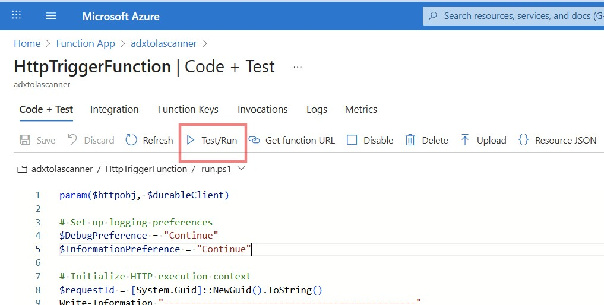
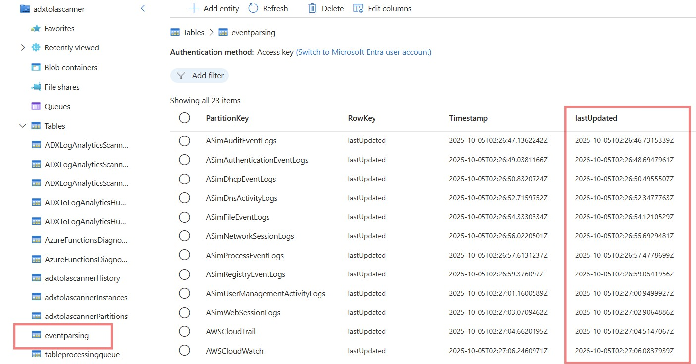

# Architecture Documentation

## Executive Summary

The ADX to Log Analytics Scanner is a serverless Azure Function App that continuously monitors Azure Data Explorer (ADX) for security events and forwards them to Microsoft Sentinel via Data Collection Rules (DCRs). The solution implements a **queue-managed orchestration pattern** using Azure Durable Functions for fault-tolerant, near real-time processing.

## Architectural Overview

### High-Level Architecture

```
┌─────────────────────────────────────────────────────────────────────┐
│                     ADX to Log Analytics Scanner                    │
│              Fault-Tolerant Near Real-Time Processing              │
└─────────────────────────────────────────────────────────────────────┘
                                    │
                                    ▼
┌─────────────────────────────────────────────────────────────────────┐
│                        Entry Points Layer                          │
├─────────────────────┬───────────────────────────────────────────────┤
│  HttpTriggerFunction │           TimerTriggerFunction               │
│  (Manual Trigger)    │           (Configurable Schedule)           │
│  HTTP GET/POST       │           Dev: Daily | Prod: 10min          │
└─────────────────────┴───────────────────────────────────────────────┘
                                    │
                                    ▼
┌─────────────────────────────────────────────────────────────────────┐
│                     Orchestration Layer                             │
├─────────────────────────────────────────────────────────────────────┤
│                    SupervisorFunction                              │
│  • 10-minute supervisor cycles                                     │
│  • Dynamic table discovery from environment variables              │
│  • Queue initialisation and management                             │
│  • Processing window calculation (9.5 minutes)                     │
│  • Environment and ADX permission validation                       │
└─────────────────────────────────────────────────────────────────────┘
                                    │
                                    ▼
┌─────────────────────────────────────────────────────────────────────┐
│                 Durable Functions Layer                            │
├─────────────────────────────────────────────────────────────────────┤
│              ContinuousQueueOrchestrator                           │
│  • **STATEFUL** - Durable Orchestration Function                   │
│  • Up to 9.75 minutes execution time                               │
│  • 15-second safety buffer for fault tolerance                     │
│  • Deterministic time management                                   │
│  • Queue-managed table processing                                  │
│  • Multiple graceful exit conditions                               │
└─────────────────────────────────────────────────────────────────────┘
                          │                    │
                          ▼                    ▼
        ┌─────────────────────────┐  ┌─────────────────────────┐
        │   QueueManagerActivity  │  │    ADXQueryActivity     │
        │   **STATELESS**         │  │   **STATELESS**         │
        │                         │  │                         │
        │ • Table selection       │  │ • Up to 8-min queries   │
        │ • Status tracking       │  │ • Schema validation     │
        │ • Round-robin rotation  │  │ • DCR forwarding        │
        │ • Error state mgmt      │  │ • Timestamp mgmt        │
        └─────────────────────────┘  └─────────────────────────┘
                          │                    │
                          ▼                    ▼
┌─────────────────────────────────────────────────────────────────────┐
│                      Data Sources Layer                            │
├─────────────────────┬─────────────────────┬─────────────────────────┤
│   Azure Storage     │   Azure Data        │   Azure Monitor         │
│   (Queue State)     │   Explorer (ADX)    │   (Log Analytics)       │
│                     │                     │                         │
│ • Table queue mgmt  │ • Security tables   │ • Data Collection       │
│ • Processing state  │ • KQL queries       │   Rules (DCRs)          │
│ • Timestamp mgmt    │ • Event data        │ • Schema validation     │
│ • REST API access   │ • Managed identity  │ • Microsoft Sentinel    │
└─────────────────────┴─────────────────────┴─────────────────────────┘
```

## Logical Architecture

| Component                       | Type             | Stateful | Durable | Description                                              |
| ------------------------------- | ---------------- | -------- | ------- | -------------------------------------------------------- |
| **TimerTriggerFunction**        | Regular Function | No       | No      | Scheduled trigger (configurable: daily dev, 10-min prod) |
| **HttpTriggerFunction**         | Regular Function | No       | No      | Manual trigger for status and execution                  |
| **SupervisorFunction**          | Regular Function | No       | No      | Stateless orchestration coordinator with 9.5-min windows |
| **ContinuousQueueOrchestrator** | Orchestration    | **Yes**  | **Yes** | Stateful orchestrator with queue-managed processing      |
| **QueueManagerActivity**        | Activity         | No       | Yes     | Stateless table selection and queue management           |
| **ADXQueryActivity**            | Activity         | No       | Yes     | Stateless query processing with up to 8-min execution    |

### HTTP and Timer Trigger Functions



The Function App is designed so that it may be invoked either through an HTTP Trigger activity directly in the portal or through continuous Timer Trigger scheduling. The HTTP trigger Function provides a method for testing and development without having to wait for schedule Timer Trigger invocation to occur.

Either of these initiation methods call the `SupervisorFunction` for starting the data processing logic.

### SupervisorFunction

Using Durable Functions provides a resilience for mission critical processes as failed workflows are queued for processing once a failure condition has been rectified.  This can also be a problem for continuous running Durable Function Apps as thousands of failed jobs can be queued if problems with development have occurred.

Durable Orchestrators can't really be used for calculations either as they are continuously restarting by design.

The intent of the Supervisor function is to resolve these issues by:

* Ensuring that a Durable Orchestrator is always running but <u>also</u> ensuring that the Durable Orchestrator is started with a clean termination datetime stamp.  

* Passing to the Durable Orchestrator the list of writeable Data Collection Rules

The example configurations in this application have the Supervisor determining the next rounded 10 minute interval within an hour (like 12:10, 12:20, 12:30 etc) and passing that datetime stamp to the Orchestrator as its "drop dead" window of operation.  This correlates to a Timer Trigger scheduled cron that can start at 10 minute intervales.  

By combining a 10 minute repetative Timer Trigger Function with a 10 minute Supervisor Function we can achieve continuously running processing without risk of enormous quantities of queued Orchestrations in a failure event.

### ContinuousQueueOrchestrator

To support multiple Worker / Activity Functions operating concurrently, the Continuous Queue Orchestrator processes "queues" (actually table entries) in a round-robin sequencing that skips tables that might be under current ptocessing.



From an Enterprise perspective this is important as it provides speed of processing but also provides flood protection against a single thread being hogged by one particular table.

### QueueManagerActivity

Manages the tables for processing by getting the next available table for processing and by updating the table processing status.


### ADXQueryActivity

The ADX Query Activity executes queries retrieved from the YAML queries file (and Log Analytics Query Pack if present) against the Azure Data Explorer cluster.

Retrieved data records are submitted to the associated Data Collection Rule for forwarding to Sentinel.
