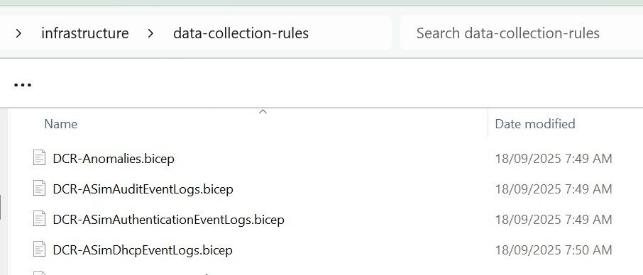
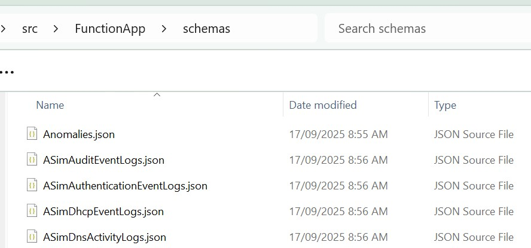
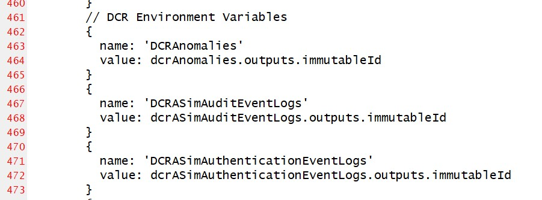
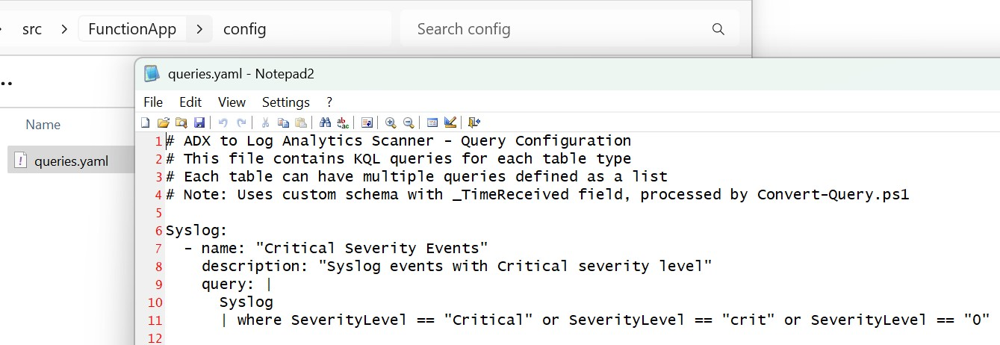

# Guide - Adding New Tables to the Data Pipeline

## Overview

Adding a new table to the ADX-to-LogAnalytics-Scanner requires coordination across multiple system components to maintain the end-to-end data flow integrity. This process ensures schema consistency, proper data transformation, and seamless integration with the existing queue-managed orchestration pattern.

# Powershell-Kusto-Schema-Tools

The project [Powershell-Kusto-Schema-Tools](https://github.com/LaurieRhodes/Powershell-Kusto-Schema-Tools) is used heavily by this data pipeline project.  Successfully scanning ADX and writing data to Log Analytics requires multiple logical components:

1. Log Analytics must be extended to support new Custom Tables (_CL table extension) as shown with [bicep-tables-from-json](https://github.com/LaurieRhodes/Powershell-Kusto-Schema-Tools/tree/main/bicep-tables-from-json)
2. Data Collection Rules must be deployed to write to the new table [dcr-from-json](https://github.com/LaurieRhodes/Powershell-Kusto-Schema-Tools/tree/main/dcr-from-json).  
3. The Function App must be extended to incorporate a schema file for the new table [json-exports](https://github.com/LaurieRhodes/Powershell-Kusto-Schema-Tools/tree/main/json-exports).  This is achieved by copying a new JSON schema into the schemas directory of the Function App. 
4. The `main.bicep` of the Function App must be updated to deploy the new DCR and reference the immutable ID as an environment variable.  Note that the Function App expects all Environment variables for DCRs to be prefaced as "DCR..." 

When the Function App starts it constructs a table of all "DCR" prefaced environment variables to know what tables it may write to.  This list of tables is correlated against queries in the YAML `queries.yaml` file.

