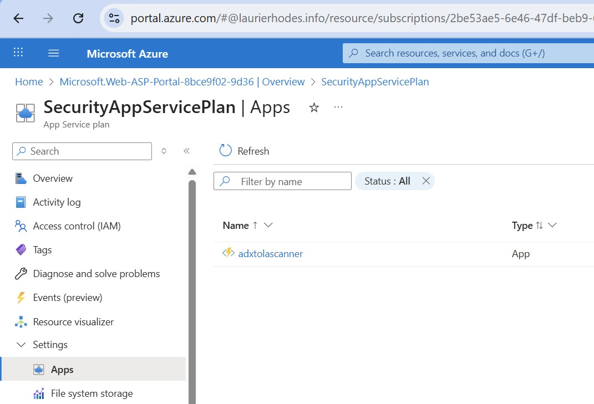

# Deployment Guide

## Prerequisites

**Azure Resources Required**:

- Resource group for deployment
- User-assigned managed identity
- Azure Data Explorer cluster
- Microsoft Sentinel workspace OR Event Hub depending on the intended destination of pipeline data

**Important** - Permissions on User-Assigned Managed Identities can take up to 24 hours to propagate on Azure Resources. Ensure that your Managed Identity is created and granted permissions well in advance of using this Function App.

### 📁 **File Structure**

```
infrastructure/
├── main.bicep                              # Main template (your target RG)
├── parameters.json                         # Configuration parameters
├── example.parameters.json                 # Example configuration
├── modules/
│   ├── querypack-permissions.bicep        # Query Pack permissions module
│   └── eventhub-permissions.bicep         # Event Hub permissions module
└── data-collection-rules/
    └── [existing DCR modules]
```

The Infrastructure directory of this project contains an `example.parameters.json` file. Copy this file to `parameters.json` and customize for your environment.

- The `data-collection-rules` directory contains a number of typical DCRs for Security related tables in Microsoft Sentinel. These are deployed as part of the pipeline. To extend the tables and DCRs for new tables, use the [Powershell-Kusto-Schema-Tools](https://github.com/LaurieRhodes/Powershell-Kusto-Schema-Tools). Note that a targeted Log Analytics Workspace must have the destination table present prior to deploying a DCR. Guidance on adding further table support to the Scanning Engine is in the markdown document [Guide - Adding New Tables.md](./Guide%20-%20Adding%20New%20Tables.md).
- The root of this project contains an example `deploy.ps1` PowerShell script that can be used for deployment of the Bicep templates.

## Parameter Configuration

### Required Parameters

All parameter names use **PascalCase** convention:

```json
{
  "$schema": "https://schema.management.azure.com/schemas/2019-04-01/deploymentParameters.json#",
  "contentVersion": "1.0.0.0",
  "parameters": {
    "Location": {
      "value": "Australia SouthEast"
    },
    "ResourceGroupID": {
      "value": "/subscriptions/{subscription-id}/resourceGroups/{rg-name}"
    },
    "FunctionAppName": {
      "value": "adx-sentinel-scanner"
    },
    "StorageAccountName": {
      "value": "adxscannersa001"
    },
    "ApplicationInsightsName": {
      "value": "adx-scanner-insights"
    },
    "UserAssignedIdentityResourceId": {
      "value": "/subscriptions/{sub}/resourceGroups/{rg}/providers/Microsoft.ManagedIdentity/userAssignedIdentities/{identity-name}"
    },
    "SentinelWorkspaceID": {
      "value": "/subscriptions/{sub}/resourceGroups/{rg}/providers/Microsoft.OperationalInsights/workspaces/{workspace-name}"
    },
    "ADXClusterURI": {
      "value": "https://cluster.region.kusto.windows.net"
    },
    "ADXDatabase": {
      "value": "SecurityLogs"
    }
  }
}
```

### Optional Parameters

The following optional parameters may be configured:

**QueryPackID** - Full Resource ID of a Log Analytics Query Pack:

```json
"QueryPackID": {
  "value": "/subscriptions/{sub}/resourceGroups/{rg}/providers/Microsoft.OperationalInsights/querypacks/{querypack-name}"
}
```

**EventHubResourceID** - Full Resource ID of an Event Hub (for alternate data destination):

```json
"EventHubResourceID": {
  "value": "/subscriptions/{sub}/resourceGroups/{rg}/providers/Microsoft.EventHub/namespaces/{namespace}/eventhubs/{eventhub-name}"
}
```

**ExistingAppServicePlanResourceId** - Full Resource ID of an existing App Service Plan:

```json
"ExistingAppServicePlanResourceId": {
  "value": "/subscriptions/{sub}/resourceGroups/{rg}/providers/Microsoft.Web/serverfarms/{plan-name}"
}
```

Leave optional parameters as empty strings (`""`) if not using these features.

## Deployment Steps

### 1. Configure Parameters

Copy and edit the example parameters file:

```bash
cp infrastructure/example.parameters.json infrastructure/parameters.json
# Edit parameters.json with your environment details
```

### 2. Deploy Infrastructure

```powershell
# Full deployment (infrastructure + code)
./deploy.ps1
```

Or manually using Azure CLI:

```bash
az deployment group create \
  --resource-group {your-resource-group} \
  --template-file infrastructure/main.bicep \
  --parameters infrastructure/parameters.json
```

### 3. Deploy Function App Code

After infrastructure deployment, deploy the Function App code:

```powershell
# From project root
cd src/FunctionApp

# Publish to Azure
func azure functionapp publish {FunctionAppName}
```

## Production Configuration Changes

### Timer Trigger Schedule

The initial project is configured for testing. The scanning component will run for a 10-minute block when triggered by the SupervisorFunction (HTTP trigger). For production, you should enable automatic continuous processing.

To change to production schedule:

1. Edit `src/FunctionApp/TimerTriggerFunction/function.json`
2. Redeploy the Function App code

**Development (default)**: `0 0 9 * * *` - daily at 9 AM  
**Production**: `0 0,10,20,30,40,50 * * * *` - every 10 minutes

### Concurrent Worker Processing

The initial project is configured for testing with a single Activity Function. For production environments, increase concurrent processing to prevent one table from monopolizing processing time.

1. Edit `src/FunctionApp/host.json`
2. Update the `maxConcurrentActivityFunctions` setting:

```json
{
  "extensions": {
    "durableTask": {
      "maxConcurrentActivityFunctions": 5
    }
  }
}
```

3. Redeploy the Function App code

### App Service Plan

The initial project uses a Consumption Plan for simplicity. For production se of an App .Service Plan is STRONGLY recommended:



**Benefits of Dedicated App Service Plan:**

- More cost-effective for continuous running Functions
- Better performance and reliability
- Enables VNet integration
- Supports App Service Environments for enterprise network isolation
- Predictable costs

Microsoft can throttle available resources for long running Consumption Plan Functions than can end up with unpredictable and unreliable results.  For an Enterprise environment, App Service Plan use should be considered as a critical dependency for Security Alerting.

**To use an existing App Service Plan:**

Add the `ExistingAppServicePlanResourceId` parameter to your `parameters.json`:

```json
"ExistingAppServicePlanResourceId": {
  "value": "/subscriptions/{sub}/resourceGroups/{rg}/providers/Microsoft.Web/serverfarms/{plan-name}"
}
```

Then redeploy the infrastructure using `./deploy.ps1` or the `az deployment` command.


---

**Last Updated:** October 2025  
**Version:** 2.0 (PascalCase standardization)
