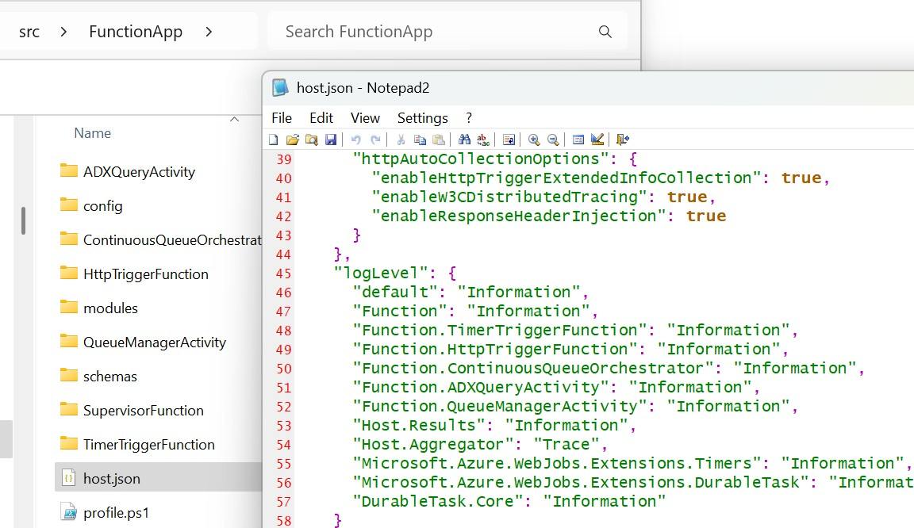
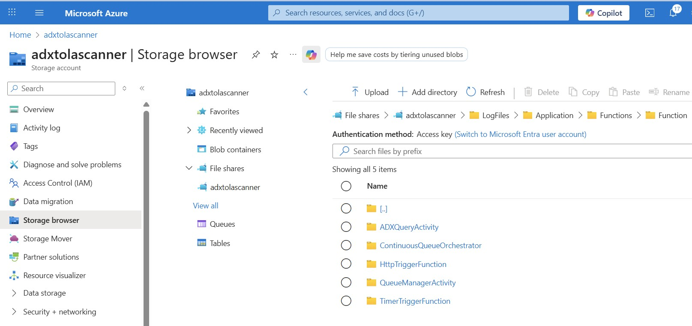
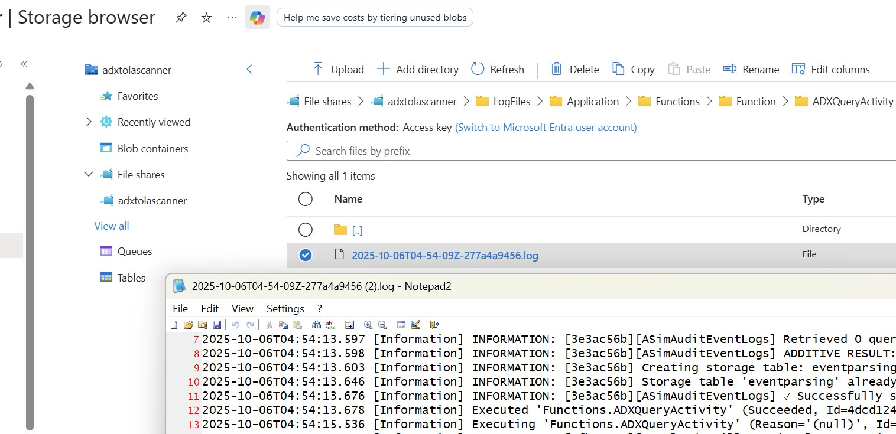

# Troubleshooting

## Logging Level

The default logging level is set at an application level and potentially overridden at a Function level.  This may be change to allow for Debug level logging within the Function App if required.

## Function App Logs

Function App logs may be accessed through the Storage Browser service of the deployed Storage Account.  Logs corresponding to each function are contained within each directory and may be downloaded for review.

